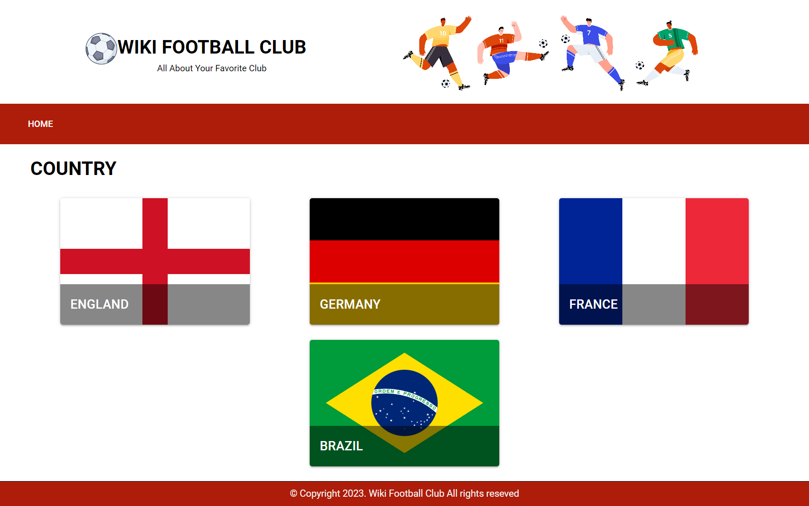
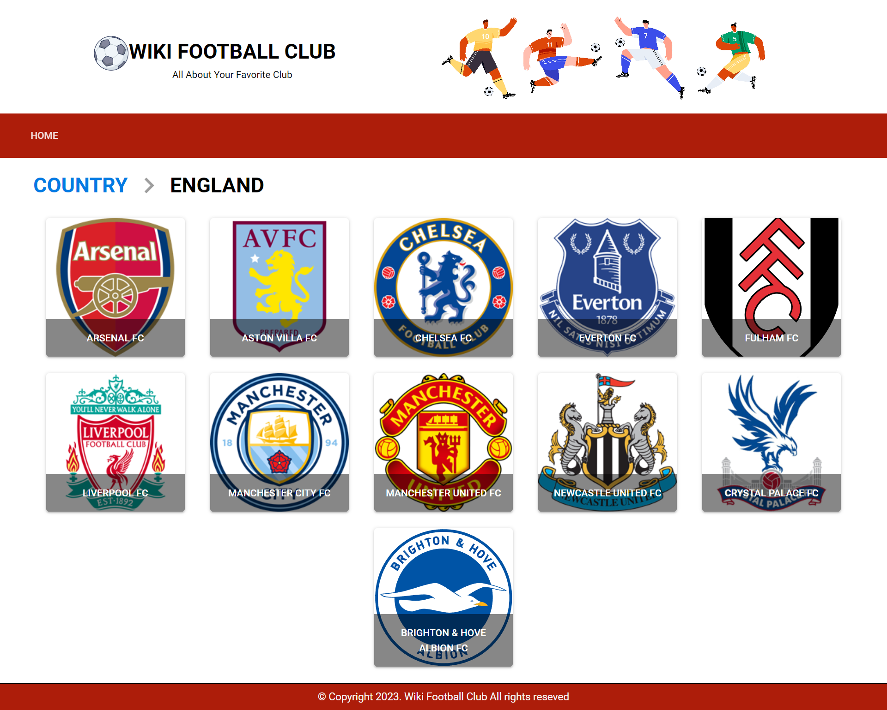
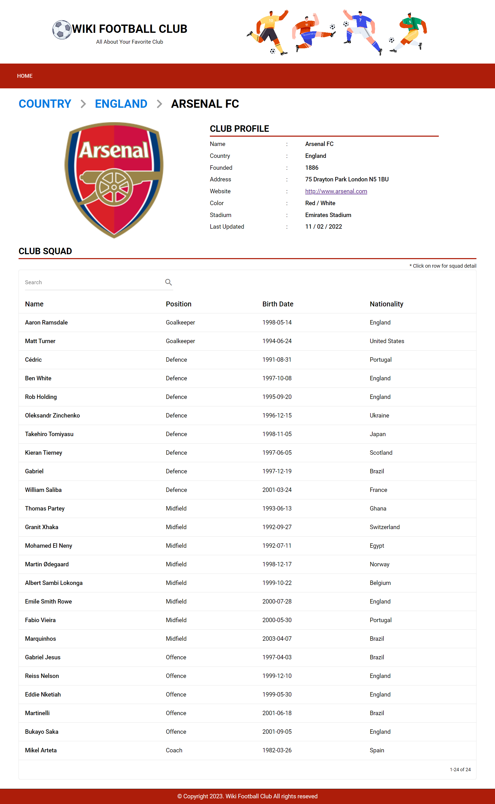
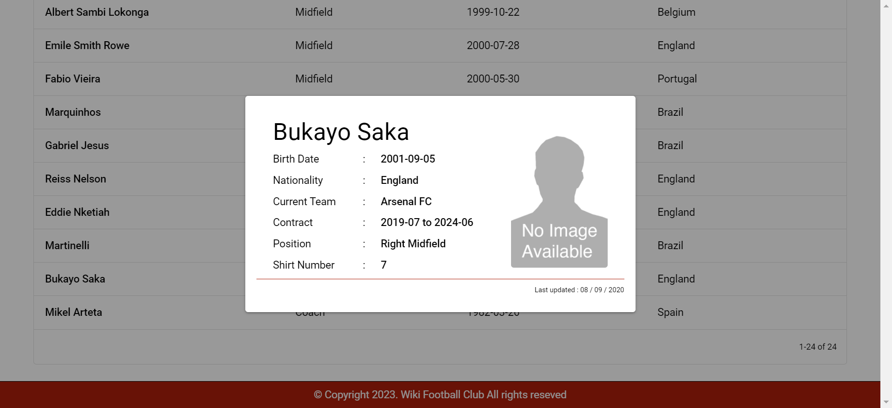

# fe-football-jojonmc-01-2023

## WEBSITE URL

        https://wikifootballclub-jjmc-fathoni.web.app/

## HOW TO OPEN FROM GIT REPOSITORY

    1. git clone https://github.com/rahfathoni/fe-football-jojonmc-01-2023.git
    2. npm install
    3. npm run serve

Start date: 18 January 2023\
Finish date: 21 January 2023

## NOTES ABOUT SERVICE API http://api.football-data.org

```diff
-Access to XMLHttpRequest at 'http://api.football-data.org/v4/areas/' from origin 'http://localhost:8080' has been blocked by CORS policy: Response to preflight request doesn't pass access control check: No Access-Control-Allow-Origin' header is present on the requestedresource.
```

Because I always getting this error when I try access the services from API http://api.football-data.org, I create my own LIMITED DUMMY DATA with data mostly based on that API.

## WEBSITE OVERVIEW

```diff
+notes: all this use limited dummy data that I created myself, most of the data based on API http://api.football-data.org.
```

### 1. Home page

List of all country available. Click one of the country.



### 2. Club area page

List of all club available in selected country. Click one of the club.



### 3. Club detail page

Detail from selected club. Click one of the squad in list.



### 4. Player detail dialog

Detail from selected squad member.



## Project setup

```
npm install
```

### Compiles and hot-reloads for development

```
npm run serve
```

### Compiles and minifies for production

```
npm run build
```

### Lints and fixes files

```
npm run lint
```

### Customize configuration

See [Configuration Reference](https://cli.vuejs.org/config/).
